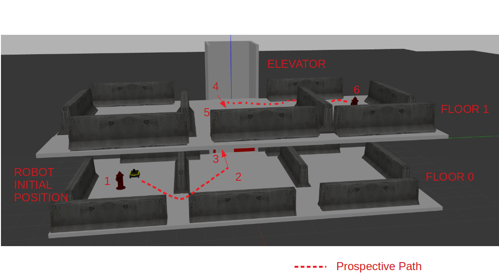

# Jackal in Elevator World
This repo has a sample world that is built on top of the [Gazebo Elevator world](https://github.com/osrf/gazebo_tutorials/blob/master/elevators/tutorial.md). This has been tested in `ROS melodic`.

## Simulation scenario

In addition to the elevator, the sample world here has 2 floors and barricades to simulate walls. The floors are called floor 0 and floor 1. The configuration of these barricades creates 2 boxed areas in each of the floors. The way these barricades are arranged are slightly different making the generated maps from these floors NOT identical. The world also spawns a [Clearpath Jackal](http://www.clearpathrobotics.com/assets/guides/melodic/jackal/) robot by default in floor 0.



Here, the numbers denote the waypoints as follows:

1. Near fire hydrant floor 0: `(4.0,-5.0,0.5)`
2. In front of elevator floor 0: `(3.0,-0.5,0.5)`
3. Inside elevator floor 0: `(0.0,-0.5,0.5)`
4. Inside elevator floor 1: `(0.0,-0.5,3.2)`
5. In front of elevator floor 1: `(3.0,-0.5,3.2)`
6. Near fire hydrant floor 1: `(4.0,5.0,3.2)`

## Install

### Get dependencies
Jackal Gazebo Dependencies:

If using ROS melodic, run:

```
$ sudo apt-get install ros-melodic-jackal-*
```

If using ROS noetic, run:

```
$ sudo apt-get install ros-noetic-jackal-*
$ cd <your-workspace>/src/
$ git clone git@github.com:jackal/jackal_simulator.git
$ git clone git@github.com:jackal/jackal_desktop.git
```

### Install package
1. Create a ROS workspace, for e.g. `catkin_ws`
2. Place this package inside the `src` folder of `catkin_ws`
3. In `catkin_ws`, issue `catkin make` command
4. Source the workspace `source devel/setup.bash`

## Run a sample simulation

To launch the simulation, use the following `roslaunch` command:

```
roslaunch jackal_elevator jackal_elevator_nav.launch 
```

You can see the Jackal robot spawned on floor 0 at waypoint `1`. 

**NOTE:** The map loaded by default is the INCORRECT map. One needs to use some mapping technique to generate the maps for these floors and reconfigure the [launch file](launch/jackal_elevator_nav.launch) with the appropriate map parameters.


To call the elevator to floor 0, publish to the `/elevator` topic as follows:

```
rostopic pub /elevator std_msgs/String "data: '0'"
```

**NOTE:** Elevator door is held open for about 10 seconds. If the elevator is already at a given floor, this command just opens the door.

To call the elevator to floor 1, publish to the `/elevator` topic as follows:

```
rostopic pub /elevator std_msgs/String "data: '1'"
```